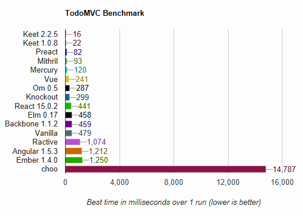

# keet.js v2

<!-- AUTO-GENERATED-CONTENT:START (SHEILDS) -->
[](https://www.npmjs.com/package/keet) [](https://wzrd.in/standalone/keet@latest) [](https://www.npmjs.com/package/keet) [](https://travis-ci.org/syarul/keet) [](https://coveralls.io/github/syarul/keet?branch=master)
<!-- AUTO-GENERATED-CONTENT:START (SHEILDS) -->
<!-- AUTO-GENERATED-CONTENT:END -->

A solution to write clean interface for web application.

- Stop polluting html template/string within JavaScript codes, know when your code smells [iffy](https://sourcemaking.com/refactoring/smells)

- Get youself a service by having your application to be of [small-program design](https://sourcemaking.com/antipatterns/spaghetti-code) 

- Live up to the standard of [Unix Philosophy](http://www.faqs.org/docs/artu/ch01s06.html)

## Perf Test

> Tested with keet.js version 1.0.8 / latest



_(Results for Microsoft Edge 41 + Windows 10 on Dell OptiPlex 5040)_

> Performance best in Microsoft Edge, slightly lower in Chrome (*Both version of keet.js does not make of difference)

You can get the test from https://github.com/syarul/preact-perf

The todoMVC you can get it here https://github.com/syarul/keetjs-todomvc

## Streamlike flow

This view layer is meant to be used as a compliment to [Node.js stream](https://nodejs.org/api/stream.html) design philosophy and to take that advantage fully in the browser environment. As sample case of usage;

```javascript
const str = require('string-to-stream')
const FetchStream = require('keet/fetchStream')
const Keet = require('keet')
const vpipe = require('keet/vpipe')

class App extends Keet {
  constructor(){
    super()
  }
  
  _clickHandler(evt){
    console.log('I\'m cool yo!')
  }
}

const app = new App()

const sink = new vpipe(app)

const fetchStream = new FetchStream()

str('./data.json').pipe(fetchStream).pipe(sink)

module.exports = app

```


The ```data.json``` sample

```json
{
  "template": "{{foo}}",
  "mountPoint": "app",
  "foo": {
    "tag": "button",
    "template": "click me",
    "k-click": "clickHandler()"
  }
}
```

## Basic usage

```javascript

const Keet = require('keet')

class App extends Keet {
  constructor(){
    super()
  }
}

const app = new App()

const obj = {
    template: '{{example}}',
    example: {
        tag: 'div',
        style: {
            'font-style': 'italic'
        },
        template: 'hello world'
    }
}

app.mount(obj).link('app') //'app' is the mount point of our DOM

```

Which will result into

```html
<div id="app">
  <!--result start-->
  <div id="example" style="font-style:italic;">hello world</div>
  <!--result end-->
</div>
```

Once mounted, the attributes of applied object are observables,

```javascript
obj.example.template = 'hello keet!'

```
the corresponding DOM will reactively changed into 
```html
<div id="app">
  <!--result start-->
  <div id="example" style="font-style:italic;">hello keet!</div>
  <!--result end-->
</div>
```
And the better option is by using the built-in helper function, or you can write your own helper
```javascript
app.contentUpdate('example', 'hello keet!')

```
To use event handlers we can simply assign key properties of the object with strings starting with 'k-' i.e for click event:- 'k-click' 

```javascript
const event = {
    template: '{{example}}',
    example: {
        tag: 'button',
        'k-click': 'clickHandler()',
        template: 'click me'
    },
    clickHandler: function(evt){
      console.log('I was clicked!')
    }
}

app.mount(event).link('app')

```

## Delegation

To mount multiple Javascript objects that inherit properties from another object, use ```Keet.prototype.cluster```

```javascript
const first = {
    template: '{{me}}',
    me: {
        tag: 'div',
        id: 'me'
    }
}

const child = () => {
  const second = {
    template: '{{cool}}',
    cool: {
        tag: 'div',
        template: 'I\'m cool yo!'
    }
  }
  const sec = new App()
  sec.mount(second).link('me')
} 

app.mount(first).link('app').cluster(child)
```

See sample folder for more usage

## License

The MIT License (MIT)

Copyright (c) 2018 Shahrul Nizam Selamat
  
