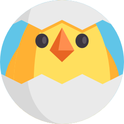

<h1 align="center">
  <!-- Logo -->
  <a href="https://syarul.github.io/keet/" alt="keet.js">
    
  </a>

  <br/>
  <!-- AUTO-GENERATED-CONTENT:START (VER) -->
# Keet v4.2.2
<!-- AUTO-GENERATED-CONTENT:END -->
</h1>

<!-- AUTO-GENERATED-CONTENT:START (SHEILDS) -->
[](https://www.npmjs.com/package/keet) [](https://cdn.rawgit.com/syarul/keet/master/keet-min.js) [](https://www.npmjs.com/package/keet) [](https://travis-ci.org/syarul/keet) [](https://coveralls.io/github/syarul/keet?branch=master) [](https://standardjs.com)
<!-- AUTO-GENERATED-CONTENT:START (SHEILDS) -->
<!-- AUTO-GENERATED-CONTENT:END -->

Minimalist view layer for the web.

## What is Keet

> *Keet* specific goal is to offer freedom of [cumbersome frameworks](https://medium.com/dailyjs/the-deepest-reason-why-modern-javascript-frameworks-exist-933b86ebc445), familiar/vanilla code structures and a possible remedy to [*choice paralysis*](https://the-pastry-box-project.net/addy-osmani/2014-January-19).  Generally *Keet* is more flexible, decent [render performance](https://raw.githubusercontent.com/syarul/preact-perf/master/img/2018-18-08.png), loosely coupled and has shallow learning curve. It's also only 6kb gzip in size.

## Getting Started

To try out Keet is to include it from a CDN or npm.

Create a HTML file:-

<!-- AUTO-GENERATED-CONTENT:START (HTML) -->
```html
<html>
  <head>
    <script src="//cdn.rawgit.com/syarul/keet/esm-4/keet-min.js"></script>
  </head>
  <body>
    <div id="app"></div>
  </body>
  <script>
    // your codes goes here
  </script>
</html>
```
<!-- AUTO-GENERATED-CONTENT:END -->

Or from npm:-

```npm install keet```

## Resources

<!-- AUTO-GENERATED-CONTENT:START (RESOURCES) -->
- Usage/API Examples - https://github.com/syarul/keet/tree/esm-5/examples
- TodoMVC Implementation - https://github.com/syarul/keetjs-todomvc
- Performance (opinionated) - https://github.com/syarul/preact-perf
<!-- AUTO-GENERATED-CONTENT:END -->

## Sample Usage


### Hello World

Start by constructing a class expression as child of ```Keet```. Supply a string argument
to the component method ```mount```. Within the string, you can assign a state within handlebars i.e: ``````.

> NOTE: You also may use ternary expression as your state i.e: ```{{<ternaryState>?show:hide}}``` where
```<ternaryState>``` is a ```boolean``` value

<!-- AUTO-GENERATED-CONTENT:START (HELLO) -->
```js
import Keet from 'keet'
import { getId } from 'keet/utils'

class App extends Keet {
  el = 'app'
  state = 'World'

  componentDidMount () {
    console.assert(getId('app').innerHTML === 'Hello World', 'hello test')
  }

  render () {
    return 'Hello {{state}}'
  }
}

export default new App()
```
<!-- AUTO-GENERATED-CONTENT:END -->

### Counter

Basic idea how we can create a simple counter

<!-- AUTO-GENERATED-CONTENT:START (COUNTER) -->
```js
/* global Event */
import Keet, { html } from 'keet'
import { getId } from 'keet/utils'

let counter

class App extends Keet {
  el = 'app'
  count = 0

  add (evt) {
    this.count++
  }

  componentDidMount () {
    const click = new Event('click', { bubbles: true, cancelable: true })
    counter = getId('counter')
    counter.dispatchEvent(click)
  }

  componentDidUpdate () {
    console.assert(counter.innerHTML === '1', 'counter test')
  }

  render () {
    return html`
      <button id="counter" k-click="add()">
        {{count}}
      </button>
    `
  }
}

export default new App()
```
<!-- AUTO-GENERATED-CONTENT:END -->

## Dynamic Nodes

The traditional way, is you assign ```display:none``` to style attributes or use css, which still use resources. To use it wrap your html string with ```{{?<state>}}<myDynamicNode>{{/<state>}}``` and assign boolean value to the state.

> NOTE: With dynamic nodes it complete remove your node from the DOM and free up your resources which is good on mobile devices.

<!-- AUTO-GENERATED-CONTENT:START (CONDITIONAL_NODES) -->
```js
import Keet from 'keet'

class App extends Keet {
  el = 'app'
  show = true

  toggle () {
    this.show = !this.show
  }

  render () {
    return `
      <button id="toggle" k-click="toggle()" attr="{{show?foo:bar}}" style="color: {{show?red:blue}};" {{show?testme:test}}>toggle</button>
      <div id="1">one</div>
      <!-- {{?show}} -->
      <div id="2">two</div>
      <div id="3">three</div>
      <div id="4">four</div>
      <!-- {{/show}} -->
      <div id="5">five</div>
    `
  }
}

export default new App()
```
<!-- AUTO-GENERATED-CONTENT:END -->

## List Rendering

To map an array to elements use the ```{{model:<myModelName>}}<myModelTemplate>{{/model:<myModelName>}}```. It has basic methods add/update/remove. To go beyond that requirement you could ```extend``` the ```class``` method of ```createModel```


> NOTE: Only mutation methods has attached listener, so usage of ```map``` ```filter``` ```reduce``` ```concat``` or directly reassigned new value to the ```list``` is encouraged and does not affect the ```dom-diffing``` efficiency. 

<!-- AUTO-GENERATED-CONTENT:START (MODEL) -->
```js
import Keet, { html, CreateModel } from 'keet'
import { getId } from 'keet/utils'

class App extends Keet {
  el = 'app'
  task = new CreateModel()

  componentWillMount () {
    this.task.subscribe(model =>
      this.callBatchPoolUpdate()
    )
  }

  componentDidMount () {
    let taskList = JSON.parse(JSON.stringify(this.task.list))
    // update a task
    this.task.update({ ...taskList[0], taskName: 'sleep', complete: true })
    this.task.destroy(taskList[taskList.length - 1])
  }

  componentDidUpdate () {
    console.assert(getId('list').childNodes.length === 6)
  }

  render () {
    let name = 'myModel'

    let taskName = ['run', 'jog', 'walk', 'swim', 'roll']

    taskName.map((task, i) => {
      this.task.add({
        taskName: task,
        complete: i % 2 !== 0
      })
    })

    return html`
      <h1>${name}</h1>
      <ul id="list">
        <!-- {{model:task}} -->
        <li>
          {{taskName}}
          <input type="checkbox" checked="{{complete?checked:null}}">
        </li>
        <!-- {{/model:task}} -->
      </ul>
    `
  }
}

export default new App()
```
<!-- AUTO-GENERATED-CONTENT:END -->

## Sub Component

Writing everything in a single file is not advisable, where you should split multiple components. To have multiple components together, use the sub-component feature with ```{{component:<mySubComponent>}}```.

> NOTE: Always has a root-element with id on sub-components html template literal, so the main component able to lookup for insertion.

<!-- AUTO-GENERATED-CONTENT:START (SUB_COMPONENT) -->
```js
import Keet from 'keet'
import { html } from 'keet/utils'

class Sub extends Keet {
  // provide the node id where this sub will rendered
  el = 'sub'
}

const sub = new Sub()

sub.mount(html`
  <div id="sub">
    this is a sub-component
  </div>
`)

class App extends Keet {
  subc = sub
}

const app = new App()

app.mount(html`
  <div id="container">
    <div>parent</div>
    <!-- {{component:subc}} -->
  </div>
`).link('app')

```
<!-- AUTO-GENERATED-CONTENT:END -->

## Roadmap

- Adding documentation ( sorry for the time being )
- Arbiter custom option ( support for node diffing algorithm by checking boolean attributes added as option rather than hard coded )
- do [js-framework-benchmark](https://github.com/krausest/js-framework-benchmark) test

## License

The MIT License (MIT)

Copyright (c) 2018 Shahrul Nizam Selamat
  
